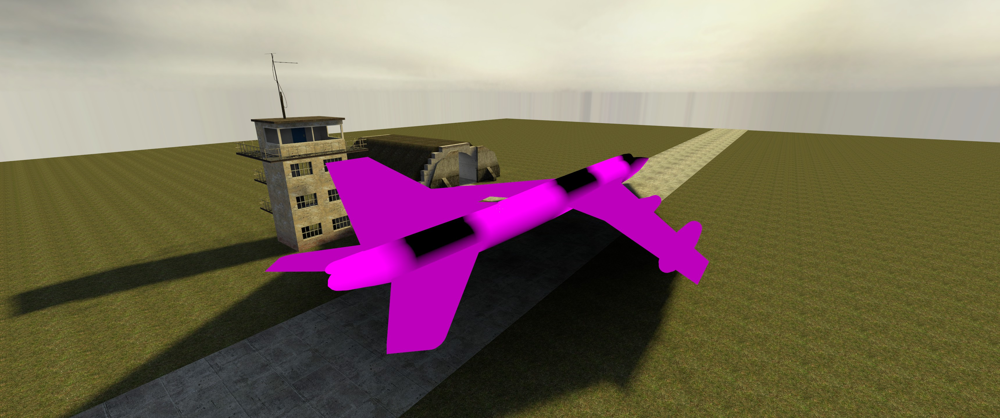
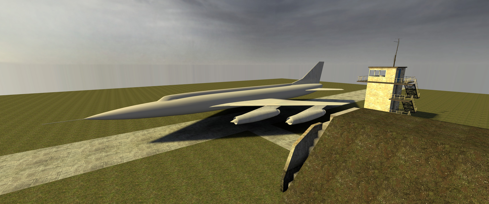
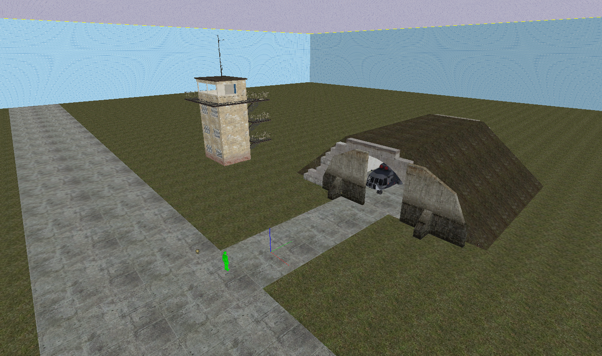

Source engine map of based on a soviet airbase in the former german democratic republic

Created 2015-11-08

To launch in the Hammer editor:

- Install the Source SDK Base 2013 single player from Steam "Tools" section
- Install Source SDK from Steam "Tools" section
- Run hammer via the hammer.exe in `steamapps\common\Half-Life 2\bin\hammer.exe`

## Running the map:

- Open in Hammer and click the "Run Map!" icon 

## Installing assets (Tu-24):
- Copy folders `Tu-24 Source Engine Export\materials` and `Tu-24 Source Engine Export\models` to `SteamLibrary\steamapps\common\Half-Life 2\hl2` (not sure if `SteamLibrary\steamapps\common\Half-Life 2\ep2` would also work).

## Screenshots

´

## Overview:

 